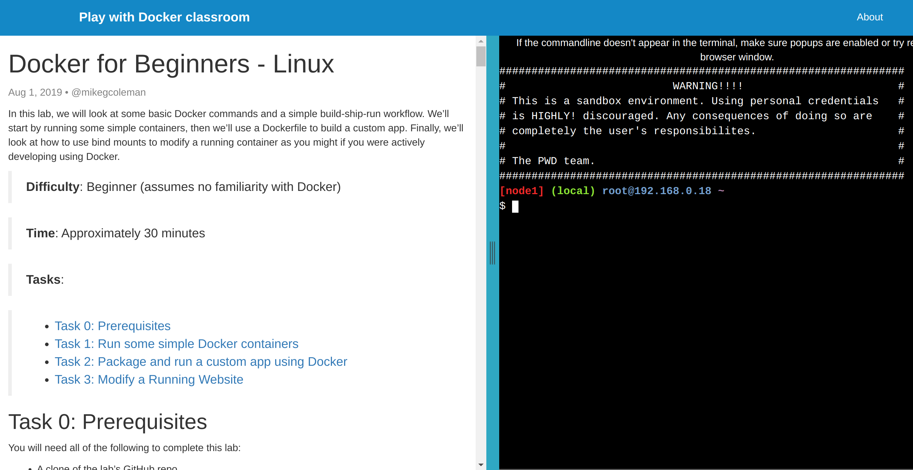

# docker-for-life
A Docker course, hopefully fun and exiting! :)

### Lecture 1
We'll have an online session, me and a terminal with you watching and interacting, exploring docker on our porjects in Pelle.

But! before that please take a time to familiarize yourself with docker terms and prepare yourself for asking good questions on our online session. :)

I picked some articles just for you, with focuse on docker terminology and simple commands. But feel free to find more if you don't feel comfortable with them. (Because you all have a running docker instance, so I skipped the installation.)

Recommended reources:
- [Play with Docker classroom](https://training.play-with-docker.com/dev-stage1/) (An online tutorial with a docker sandbox combined)

- https://docker-curriculum.com/ (Skip docker on aws or other could sections)
- https://www.freecodecamp.org/news/docker-simplified-96639a35ff36/ (You can replace fedora or ubuntu images with busybox if you are not comfortable with downloading a big image)
- https://www.guru99.com/docker-tutorial.html (Short article with almost simple commands)

### Lecture 2
After you spend some time playing with docker ;)
